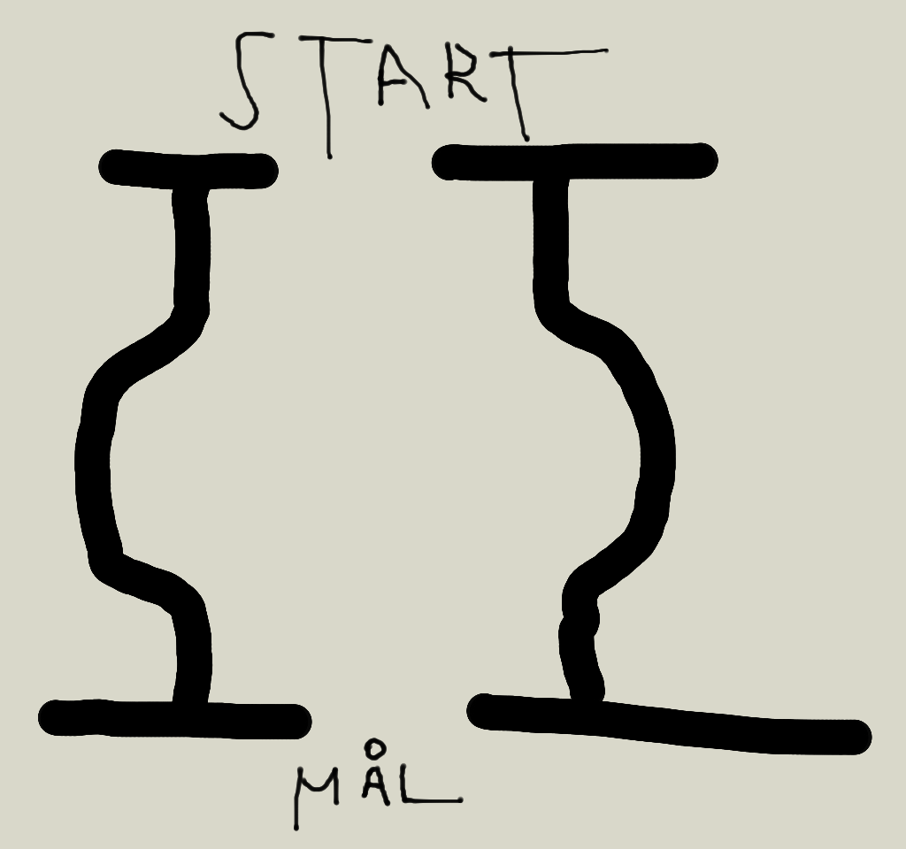

---
Week 39
=============

# Goal of the week

1. Racing and debugging

# Weekly fix points:

* Monday:
   * 10:00 Discussing and defining rules for the race
   * There is something with getting CPR numbers and nemids at 13:45 - don't forget if it applies to you.
   * 12:30 teacher meeting

# Deliverables

* Participate in defining rules
* Participate in test pair race
* Meet with a teacher (as always)

# Comments:
* RUTR is not available this week. ILES will be available for electronics related information.
* Rules:
  1. Two robots race against each other - one on each track
  2. After the first race, the robot exchange lanes, so both robots try both lanes
  3. The sum of time for both lanes determines the "time"
  3. the fastest robot continue to the next level - it is an elimination course untill only two robots remains to do the finals
  3. We might need extra rules for, say, obstruction and not finishing
* Someone (aka. a student) needs to built the course
* Draft race course
    
    
    
